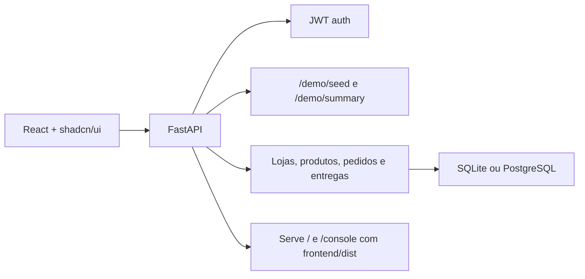

# PecaGo

Marketplace de autopecas com entrega sob demanda.

O PecaGo foi montado como um MVP de operacao ponta a ponta: lojas publicam estoque, oficinas e clientes encontram a peca certa, o pedido nasce dentro da mesma plataforma e a ultima milha fica com um perfil de entrega dedicado. O projeto combina uma API FastAPI com um frontend React pensado para demo tecnica e comercial.

## Preview


## O que este repositorio entrega

- autenticacao JWT por perfil
- cadastro de usuarios, loja e catalogo
- busca de pecas por nome, SKU, marca e modelo
- criacao de pedidos com baixa de estoque
- atribuicao de entregas e atualizacao de status
- validacao de estoque e transicoes por papel operacional
- home institucional e console operacional em React
- endpoints de demo para popular dados e resumir a operacao
- testes automatizados cobrindo seed, pedidos e fluxo de entrega

## Perfis da operacao

| Perfil | Responsabilidade |
| --- | --- |
| `store` | publica estoque, acompanha pedidos e move status da loja |
| `customer` | busca pecas e cria pedidos |
| `mechanic` | usa o mesmo fluxo de compra com foco em reposicao rapida |
| `delivery` | assume corridas disponiveis e conclui a entrega |

## Stack

| Camada | Tecnologia |
| --- | --- |
| Backend | FastAPI + SQLAlchemy |
| Frontend | React 19 + Vite + `shadcn/ui` |
| Estilo | Tailwind CSS v4 |
| Banco | SQLite para setup rapido ou PostgreSQL para ambiente mais realista |
| Auth | JWT |
| Testes | `unittest` + FastAPI `TestClient` |

## Arquitetura



## Jornada de demonstracao

1. subir a aplicacao
2. popular os dados demo com `POST /demo/seed` ou pelo botao da interface
3. entrar como `store` para validar loja, catalogo e leitura operacional
4. entrar como `customer` ou `mechanic` para buscar pecas e criar um pedido
5. voltar para `store` e mover o pedido para `accepted` ou `preparing`
6. entrar como `delivery`, assumir a corrida e concluir em `delivered`

## Credenciais demo

Depois de chamar `POST /demo/seed` ou clicar em `Popular dados demo`:

- `store@demo.com / 123456`
- `customer@demo.com / 123456`
- `delivery@demo.com / 123456`

## Como rodar localmente

### Opcao 1: rapido, com Python + SQLite

Requisito:

- Python 3.12+

Na raiz do projeto:

```powershell
.\start_local.ps1
```

Ou no Prompt de Comando:

```bat
start_local.bat
```

Esse fluxo:

- cria `.venv` se necessario
- instala dependencias
- gera `.env` com SQLite caso ele nao exista
- sobe a API em `http://127.0.0.1:8000`

Rotas uteis:

- `http://127.0.0.1:8000/`
- `http://127.0.0.1:8000/console`
- `http://127.0.0.1:8000/docs`
- `http://127.0.0.1:8000/health`

### Opcao 2: frontend React em desenvolvimento

Requisitos:

- Node.js 22+
- backend FastAPI rodando em `http://127.0.0.1:8000`

O Vite usa proxy para `/auth`, `/products`, `/orders`, `/deliveries`, `/demo` e demais rotas da API, entao o backend precisa estar ativo no endereco acima durante o desenvolvimento.

```powershell
cd frontend
npm install
npm run dev
```

Para gerar o build que o FastAPI passa a servir em `/` e `/console`:

```powershell
cd frontend
npm run build
```

Se `frontend/dist` ainda nao existir, o FastAPI usa o frontend legado em `app/static/` como fallback.

### Opcao 3: Docker com PostgreSQL

Requisito:

- Docker Desktop

```bash
docker compose up --build
```

Observacao:

O container da API serve o build React apenas se `frontend/dist` existir no momento do `docker build`. Como `frontend/dist` nao e versionado no Git, um clone limpo do repositorio vai subir usando o fallback em `app/static/` ate que voce gere o build do frontend.

### Opcao 4: Python com PostgreSQL local

1. instale Python 3.12+
2. instale PostgreSQL 16+
3. crie um banco chamado `autoparts_mvp`
4. copie `.env.example` para `.env`
5. ajuste o `DATABASE_URL`
6. instale as dependencias
7. rode a API

```bash
pip install -r requirements.txt
uvicorn app.main:app --reload
```

## Testes e validacao

Backend:

```powershell
.\.venv\Scripts\python.exe -m unittest discover -s tests -v
```

Frontend:

```powershell
cd frontend
npm install
npm run lint
npm run build
```

Os testes atuais cobrem seed demo, autenticacao, baixa de estoque, atribuicao de entrega e transicoes de status.

## Endpoints principais

| Area | Endpoints |
| --- | --- |
| Auth | `POST /auth/register`, `POST /auth/login`, `GET /auth/me` |
| Lojas e catalogo | `POST /stores`, `GET /stores`, `POST /products`, `GET /products`, `GET /products/search` |
| Pedidos | `POST /orders`, `GET /orders/my`, `PATCH /orders/{order_id}/status` |
| Entregas | `GET /deliveries/available`, `POST /deliveries/assign` |
| Demo | `POST /demo/seed`, `GET /demo/summary` |

## Estrutura do projeto

```text
app/
  core/           configuracao e seguranca
  routers/        auth, stores, products, orders, deliveries e demo
  main.py         inicializacao da API e entrega do frontend
frontend/
  src/            paginas, hooks e componentes React
  dist/           build servido pelo FastAPI quando existir
tests/
  test_api_flows.py
app/static/       frontend legado e fallback
start_local.ps1   bootstrap local com SQLite
docker-compose.yml
PITCH_1_MINUTO.md pitch comercial curto
```

## Estado atual do MVP

- cobre o ciclo principal de marketplace + entrega
- a home e o console ja foram migrados para React
- o backend protege estoque contra itens duplicados no pedido
- o fluxo operacional valida atribuicao e transicao de status por papel
- a base demo replica baixa de estoque e leitura realista da operacao
- o projeto esta pronto para demo tecnica e comercial

## Limitacoes conhecidas

- o schema e criado automaticamente no startup com `Base.metadata.create_all()`
- ainda nao ha migrations com Alembic
- o build React nao e publicado no repositorio, apenas gerado localmente
- o fallback legado em `app/static/` continua presente para facilitar demos rapidas

## Proximos passos

- adicionar migrations com Alembic
- melhorar busca por compatibilidade de veiculo
- adicionar refresh token e expiracao de sessao mais robusta
- adicionar observabilidade e telemetria para operacao real

## Material extra

- [Pitch de 1 minuto](./PITCH_1_MINUTO.md)
