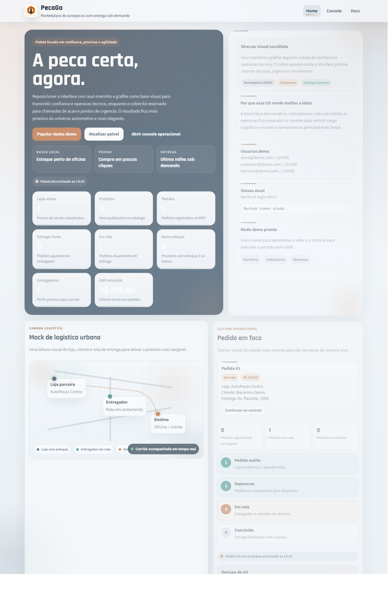
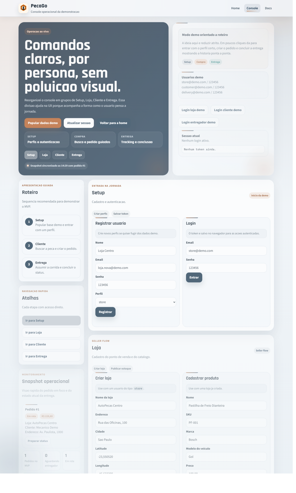
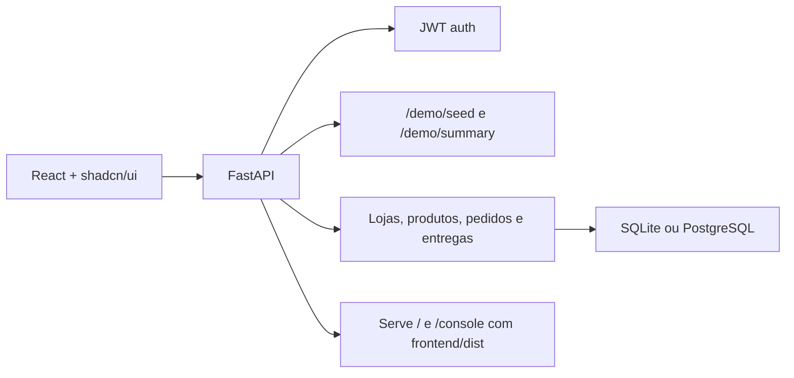

# PecaGo

Marketplace de autopecas com entrega sob demanda.

O PecaGo demonstra um fluxo ponta a ponta em que lojas publicam estoque, oficinas e clientes encontram a peca certa e entregadores assumem a ultima milha sem sair da mesma operacao.

## Preview





## O que este MVP entrega

- busca de pecas por nome, SKU, marca e modelo
- cadastro de usuarios, loja e catalogo
- autenticacao JWT por perfil
- criacao de pedidos com baixa de estoque
- atribuicao de entrega e atualizacao de status
- dashboard demo com metricas e roteiro operacional
- frontend React com `shadcn/ui` servido pela propria API

## Perfis da operacao

- `store`: publica estoque, visualiza pedidos e move status da loja
- `customer` e `mechanic`: buscam pecas e criam pedidos
- `delivery`: assume corridas disponiveis e finaliza a entrega

## Stack

- Backend: FastAPI + SQLAlchemy
- Frontend: React 19 + Vite + `shadcn/ui`
- Estilo: Tailwind CSS v4
- Banco: SQLite para teste rapido ou PostgreSQL para ambiente mais proximo de producao
- Auth: JWT

## Arquitetura



## Jornada de demonstracao

1. popular os dados demo
2. entrar com o perfil da loja e validar a operacao
3. buscar uma peca com o perfil `customer` ou `mechanic`
4. criar um pedido
5. entrar com o perfil `delivery`
6. assumir a corrida e atualizar o status ate `delivered`

## Credenciais demo

Depois de chamar `POST /demo/seed` ou clicar em `Popular dados demo`:

- `store@demo.com / 123456`
- `customer@demo.com / 123456`
- `delivery@demo.com / 123456`

## Como rodar localmente

### Opcao 1: rapido, com Python + SQLite

Requisitos:

- Python 3.12+

Na raiz do projeto:

```powershell
.\start_local.ps1
```

Ou no Prompt de Comando:

```bat
start_local.bat
```

Esse fluxo:

- cria `.venv`
- instala dependencias
- gera `.env` com SQLite caso ele nao exista
- sobe a API em `http://127.0.0.1:8000`

Rotas uteis:

- `http://127.0.0.1:8000/`
- `http://127.0.0.1:8000/console`
- `http://127.0.0.1:8000/docs`
- `http://127.0.0.1:8000/health`

### Opcao 2: frontend React em desenvolvimento

Requisitos:

- Node.js 22+

```powershell
cd frontend
npm install
npm run dev
```

Para gerar o build que a API passa a servir em `/` e `/console`:

```powershell
cd frontend
npm run build
```

Se `frontend/dist` ainda nao existir, o FastAPI usa o frontend legado em `app/static/` como fallback.

### Opcao 3: Docker com PostgreSQL

Requisitos:

- Docker Desktop

```bash
docker compose up --build
```

### Opcao 4: Python com PostgreSQL local

1. instale Python 3.12+
2. instale PostgreSQL 16+
3. crie um banco chamado `autoparts_mvp`
4. copie `.env.example` para `.env`
5. ajuste o `DATABASE_URL`
6. instale as dependencias
7. rode a API

```bash
pip install -r requirements.txt
uvicorn app.main:app --reload
```

## Endpoints principais

- `POST /auth/register`
- `POST /auth/login`
- `GET /auth/me`
- `POST /stores`
- `POST /products`
- `GET /products`
- `GET /products/search`
- `POST /orders`
- `GET /orders/my`
- `PATCH /orders/{order_id}/status`
- `GET /deliveries/available`
- `POST /deliveries/assign`
- `POST /demo/seed`
- `GET /demo/summary`

## Estrutura do projeto

```text
app/
  core/           seguranca e configuracao
  routers/        auth, stores, products, orders, deliveries e demo
  main.py         inicializacao da API e entrega do frontend
frontend/
  src/            home, console e componentes React
  dist/           build servido pelo FastAPI quando existir
app/static/       frontend legado e fallback
start_local.ps1   bootstrap local com SQLite
docker-compose.yml
PITCH_1_MINUTO.md pitch comercial curto
```

## Estado atual

- o MVP ja cobre o ciclo principal de marketplace + entrega
- a home e o console foram migrados para React com `shadcn/ui`
- o build novo esta mais leve, com lazy loading e divisao de chunks
- o projeto esta pronto para demos tecnicas e comerciais

## Proximos passos

- adicionar migrations com Alembic
- endurecer regras de estoque e transicao de status
- melhorar busca por compatibilidade de veiculo
- adicionar refresh token e expiracao de sessao mais robusta
- cobrir fluxos criticos com testes automatizados

## Material extra

- [Pitch de 1 minuto](./PITCH_1_MINUTO.md)
