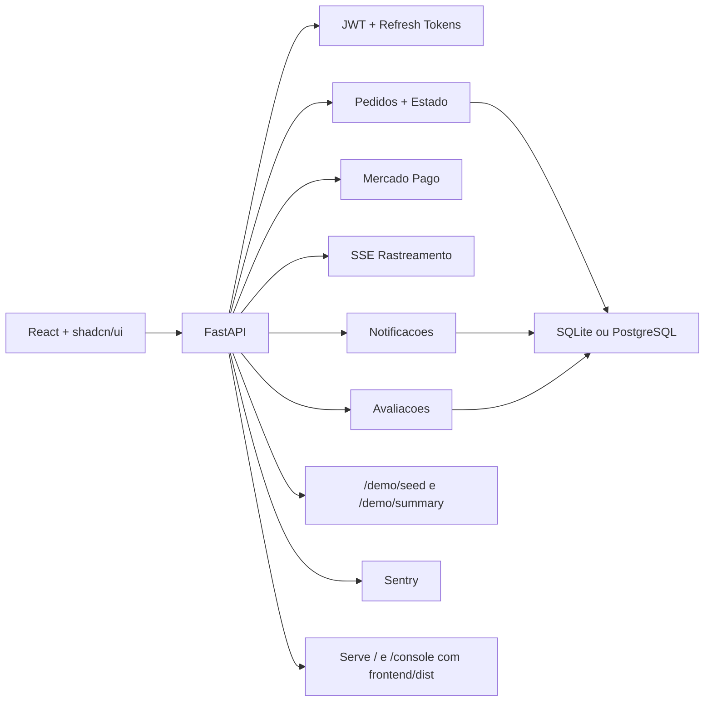

# PecaGo

Marketplace de autopecas com entrega sob demanda.

O PecaGo cobre o ciclo completo de um marketplace: lojas publicam estoque, oficinas e clientes encontram a peca certa, o pedido nasce dentro da mesma plataforma, o pagamento e processado via Mercado Pago e a ultima milha fica com um perfil de entrega dedicado — com rastreamento em tempo real e avaliacao pos-entrega.

## Preview


## O que este repositorio entrega

- autenticacao JWT com refresh token rotativo (access 30 min, refresh 30 dias)
- cadastro de usuarios por papel, loja e catalogo de produtos com imagem
- busca de pecas por nome, SKU, marca e modelo de veiculo
- criacao de pedidos com baixa de estoque atomica
- pagamento integrado com Mercado Pago (sandbox e producao)
- atribuicao de entregas, rastreamento de localizacao em tempo real via SSE
- avaliacao pos-entrega de loja e entregador com rating medio
- notificacoes em tempo real a cada transicao de status
- validacao de estoque e transicoes de status por papel operacional
- logs estruturados com structlog e request_id por requisicao
- rate limiting por endpoint (200/min global, 10/min login)
- monitoramento de erros com Sentry e healthcheck com ping ao banco
- CI/CD com GitHub Actions (testes + lint/build + deploy Railway)
- home institucional e console operacional em React
- endpoints de demo para popular dados e resumir a operacao

## Perfis da operacao

| Perfil | Responsabilidade |
| --- | --- |
| `store` | publica estoque, acompanha pedidos e move status da loja |
| `customer` | busca pecas, cria pedidos e avalia a experiencia |
| `mechanic` | usa o mesmo fluxo de compra com foco em reposicao rapida |
| `delivery` | assume corridas disponiveis, envia localizacao e conclui a entrega |

## Stack

| Camada | Tecnologia |
| --- | --- |
| Backend | FastAPI + SQLAlchemy + Alembic |
| Frontend | React 19 + Vite + `shadcn/ui` + Tailwind CSS v4 |
| Banco | SQLite (dev) ou PostgreSQL (staging/producao) |
| Auth | JWT (access) + refresh token rotativo com hash sha256 |
| Pagamento | Mercado Pago (SDK oficial) |
| Rate limiting | slowapi |
| Logs | structlog (legivel em dev, JSON em producao) |
| Monitoramento | Sentry SDK + endpoint `/health` |
| CI/CD | GitHub Actions + GHCR + Railway |
| Testes | `unittest` + FastAPI `TestClient` |

## Arquitetura



## Jornada de demonstracao

1. subir a aplicacao e popular os dados demo com `POST /demo/seed` ou pelo botao da interface
2. entrar como `store` para validar loja, catalogo e leitura operacional
3. entrar como `customer`, buscar pecas, criar um pedido e efetuar o pagamento
4. voltar para `store` e mover o pedido para `accepted` e depois `preparing`
5. entrar como `delivery`, assumir a corrida, enviar localizacao e concluir em `delivered`
6. entrar como `customer` e avaliar a loja e o entregador

## Credenciais demo

Depois de chamar `POST /demo/seed` ou clicar em `Popular dados demo`:

- `store@demo.com / 123456`
- `customer@demo.com / 123456`
- `delivery@demo.com / 123456`

## Como rodar localmente

### Opcao 1: rapido, com Python + SQLite

Requisito: Python 3.12+

```powershell
.\start_local.ps1
```

Ou no Prompt de Comando:

```bat
start_local.bat
```

Esse fluxo cria `.venv`, instala dependencias, gera `.env` com SQLite e sobe a API em `http://127.0.0.1:8000`.

Rotas uteis:

- `http://127.0.0.1:8000/` — home institucional
- `http://127.0.0.1:8000/console` — console operacional
- `http://127.0.0.1:8000/health` — healthcheck (banco + ambiente)
- `http://127.0.0.1:8000/docs` — documentacao interativa (apenas com `DEBUG=True`)

### Opcao 2: frontend React em desenvolvimento

Requisitos: Node.js 20+, backend FastAPI rodando em `http://127.0.0.1:8000`

```powershell
cd frontend
npm install
npm run dev
```

Para gerar o build que o FastAPI serve em `/` e `/console`:

```powershell
cd frontend
npm run build
```

Se `frontend/dist` ainda nao existir, o FastAPI usa o frontend legado em `app/static/` como fallback.

### Opcao 3: Docker com PostgreSQL

Requisito: Docker Desktop

```bash
docker compose up --build
```

> O container so serve o frontend React se `frontend/dist` existir no momento do `docker build`. Um clone limpo usara o fallback em `app/static/` ate voce gerar o build do frontend.

### Opcao 4: Python com PostgreSQL local

1. instale Python 3.12+ e PostgreSQL 16+
2. crie um banco chamado `autoparts_mvp`
3. copie `.env.example` para `.env` e ajuste as variaveis
4. instale as dependencias e suba a API

```bash
pip install -r requirements.txt
alembic upgrade head
uvicorn app.main:app --reload
```

## Variaveis de ambiente

Copie `.env.example` para `.env` e ajuste os valores. Para staging e producao, consulte `.env.staging.example` e `.env.production.example`.

| Variavel | Descricao |
| --- | --- |
| `ENVIRONMENT` | `development`, `staging` ou `production` |
| `DEBUG` | `True` habilita `/docs` e `/redoc`; `False` desativa |
| `DATABASE_URL` | URL do banco (SQLite para dev, PostgreSQL para prod) |
| `SECRET_KEY` | chave para assinar JWTs |
| `ALLOWED_ORIGINS` | lista JSON de origens CORS permitidas |
| `MERCADOPAGO_ACCESS_TOKEN` | `TEST-xxx` para sandbox, `APP_USR-xxx` para producao |
| `SENTRY_DSN` | DSN do projeto no sentry.io (vazio desativa) |
| `STORAGE_BACKEND` | `local` (dev) ou `s3` (producao) |

## Testes e validacao

```powershell
# Backend
.\.venv\Scripts\python.exe -m unittest discover -s tests -v

# Frontend
cd frontend
npm run lint
npm run build
```

Os testes cobrem seed demo, autenticacao, baixa de estoque, atribuicao de entrega, transicoes de status e fluxo de avaliacao.

## Endpoints principais

| Area | Endpoints |
| --- | --- |
| Auth | `POST /auth/register`, `POST /auth/login`, `POST /auth/refresh`, `POST /auth/logout`, `GET /auth/me` |
| Lojas | `POST /stores`, `GET /stores` |
| Produtos | `POST /products`, `GET /products`, `GET /products/search`, `POST /products/{id}/image` |
| Pedidos | `POST /orders`, `GET /orders/my`, `PATCH /orders/{id}/status` |
| Pagamento | `POST /orders/{id}/payment`, `POST /webhooks/mercadopago` |
| Entregas | `GET /deliveries/available`, `POST /deliveries/assign`, `PATCH /deliveries/{id}/location`, `GET /deliveries/{id}/track`, `GET /deliveries/{id}/track/stream` |
| Notificacoes | `GET /notifications`, `GET /notifications/unread-count`, `PATCH /notifications/{id}/read`, `POST /notifications/read-all` |
| Avaliacoes | `POST /reviews`, `GET /reviews/store/{id}`, `GET /reviews/delivery/{id}` |
| Demo | `POST /demo/seed`, `GET /demo/summary` |
| Sistema | `GET /health` |

## Estrutura do projeto

```text
app/
  core/           config, limiter, logging, security
  routers/        auth, stores, products, orders, deliveries,
                  notifications, payment, reviews, demo
  main.py         inicializacao da API, Sentry, serve frontend
  models.py       User, Store, Product, Order, OrderItem,
                  Notification, Review, RefreshToken
frontend/
  src/            paginas, componentes e hooks React
  dist/           build servido pelo FastAPI quando existir
tests/
  test_api_flows.py
alembic/          migrations de banco de dados
.github/workflows/
  ci.yml          testes Python + lint/build frontend
  deploy.yml      build Docker + push GHCR + deploy Railway
railway.toml      config de deploy (healthcheck, restart policy)
.env.example              template de desenvolvimento
.env.staging.example      template de staging
.env.production.example   template de producao
start_local.ps1   bootstrap local com SQLite
docker-compose.yml
```

## Material extra

- [Pitch de 1 minuto](./PITCH_1_MINUTO.md)
